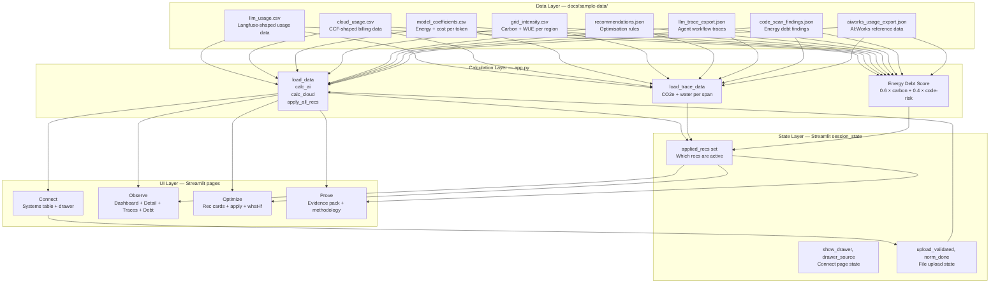

# 04 — Architecture

> **Summary:** How the TRACE app is built, how it runs, what files matter, and how data flows from raw files to the dashboard. Written for non-technical readers with technical detail available for anyone who needs it.

---

## The simple version

TRACE is a **single Python file** (`app.py`) that reads data from a folder of CSV and JSON files, does some calculations, and displays the results as an interactive web dashboard.

There is no database. There is no server running in the background. There are no live connections to external services. When you run the app, everything happens locally on your computer.

---

## How the app runs

**To start the app:**
```
streamlit run app.py
```

This opens a web browser (or a browser tab) showing the TRACE dashboard. The app loads all data files at startup and holds everything in memory. Page changes happen instantly because there is no round-trip to a server.

**Dependencies** (from `requirements.txt`):
- `streamlit` — the web framework that handles the dashboard layout, navigation, and interactive widgets
- `pandas` — the data analysis library that loads and processes the CSV files
- `plotly` — the charting library that creates the interactive charts

That's it. Three dependencies. No database driver, no API client, no authentication library.

---

## Architecture diagram



---

## Data flow step by step

### 1. App starts

When `streamlit run app.py` is run, Streamlit executes the entire `app.py` file from top to bottom.

### 2. Data is loaded (cached)

Four functions load data from the `docs/sample-data/` folder:

| Function | Files loaded | What it produces |
|---|---|---|
| `load_data()` | `llm_usage.csv`, `cloud_usage.csv`, `model_coefficients.csv`, `grid_intensity.csv`, `recommendations.json`, `semgrep_findings.json` | Raw DataFrames for LLM usage and cloud usage, plus lookup tables |
| `load_trace_data()` | `llm_trace_export.json` | Trace data with CO₂e and water calculated per span |
| `load_aiworks_data()` | `aiworks_usage_export.json` | AI:Works reference data |
| `load_code_findings()` | `code_scan_findings.json` | Code scan finding records |

These functions are decorated with `@st.cache_data`, which means Streamlit only loads each file once and keeps the result in memory. Re-running the app does not re-read the files unless they change.

### 3. Baseline calculations run

Immediately after loading, three calculations produce the baseline metrics:

```python
ai_base    = calc_ai(llm_raw, coeffs, grid)        # AI footprint at baseline
cloud_calc = calc_cloud(cloud_raw, grid)             # Cloud footprint
ai_curr    = apply_all_recs(llm_raw, coeffs, grid,  # AI footprint with any applied recs
                            st.session_state.applied_recs, recs)
```

These run every time any page is loaded or any button is clicked, because Streamlit re-executes the whole script on each interaction. The cached data functions mean re-reading files is avoided, but the calculations run fresh each time.

### 4. Page routing

Streamlit reads `st.session_state["page"]` (driven by the sidebar radio buttons) and renders the appropriate page block. The four page blocks are large `if/elif` sections in `app.py`.

### 5. Recommendation state

Applied recommendations are stored in `st.session_state.applied_recs` — a Python set containing the IDs of applied recommendations. When any Apply button is clicked, the recommendation ID is added to this set, and `st.rerun()` triggers a full re-render. `apply_all_recs()` uses this set to determine which optimisations to apply in the calculation.

---

## Important files

| File | Role |
|---|---|
| `app.py` | The entire application — ~1,430 lines of Python |
| `requirements.txt` | Three dependencies: streamlit, pandas, plotly |
| `docs/sample-data/llm_usage.csv` | Synthetic LLM usage data (Langfuse-shaped) |
| `docs/sample-data/cloud_usage.csv` | Synthetic cloud billing data (CCF-shaped) |
| `docs/sample-data/model_coefficients.csv` | Energy and cost coefficients per model class |
| `docs/sample-data/grid_intensity.csv` | Grid carbon intensity and WUE per region |
| `docs/sample-data/recommendations.json` | Optimisation rules with hand-authored expected values |
| `docs/sample-data/llm_trace_export.json` | Synthetic agent workflow traces |
| `docs/sample-data/code_scan_findings.json` | Synthetic code scan (SDLC energy debt) findings |
| `docs/sample-data/aiworks_usage_export.json` | AI:Works usage reference data |
| `docs/sample-data/finops_cloud_export.csv` | Sample file for the Connect page upload demo |
| `docs/sample-data/generate.py` | Deterministic data generator (seed=42) |

---

## The CCF codebase (present but not active)

Because TRACE is built from a **fork of the Cloud Carbon Footprint repository**, the full CCF TypeScript codebase (`packages/` directory) is also present in the project folder. This contains approximately 82,500 lines of TypeScript across 742 source files — the original CCF API server, AWS/Azure/GCP connectors, React dashboard, and CLI.

**None of this code runs when you run `streamlit run app.py`.** The Python app and the TypeScript codebase are completely separate. The CCF code is the inherited starting point from the fork; the TRACE MVP is a new, independent Python application.

See `05-ccf-integration.md` for a full explanation of this relationship.

---

## Session state (how the app remembers things)

Streamlit does not keep variables in memory between page interactions the way a traditional web app does. Instead, TRACE uses `st.session_state` — a dictionary that Streamlit preserves across re-renders.

The key session state variables are:

| Key | What it stores | Default |
|---|---|---|
| `applied_recs` | Set of recommendation IDs that have been applied | Empty set |
| `show_drawer` | Whether the Connect drawer is open | False |
| `drawer_source` | Which source type is selected in the drawer | None |
| `drawer_method` | Which connection method is selected | None |
| `uploaded_file_name` | Name of the file that was uploaded | None |
| `upload_validated` | Whether the uploaded file passed validation | False |
| `mapping_saved` | Whether field mapping was saved | False |
| `norm_done` | Whether normalization completed | False |

---

## Constants in app.py

Two important lookup dictionaries are defined directly in the code:

**`REGION_CARBON_KG`** — maps region names to grid carbon intensity in kg CO₂e per kWh:
```python
REGION_CARBON_KG = {
    "us-east-1": 0.380, "us-east-2": 0.355,
    "us-west-2": 0.210, "us-west-1": 0.228,
    "us-west": 0.210, "us-east": 0.380,
    "eu-west-1": 0.290, "eu-west": 0.290,
    "us-central-1": 0.355,
    "ap-south-1": 0.630, "ap-south": 0.630,
}
```

**`MODEL_KWH_PER_1M`** — maps named model identifiers to kWh per million tokens:
```python
MODEL_KWH_PER_1M = {
    "claude-sonnet-4-6": 0.6, "claude-opus-4-8": 1.2,
    "claude-haiku-4-5": 0.3, "gpt-4.1": 0.5, "gpt-4o": 0.6,
    "large": 1.2, "mid": 0.6, "small": 0.3,
}
```

These constants are used for the agent trace calculations (where model names come from JSON, not the CSV model class labels).

---

## How to run the app locally

**Prerequisites:** Python 3.8 or later.

**Install dependencies:**
```bash
pip install -r requirements.txt
```

**Run the app:**
```bash
streamlit run app.py
```

**Regenerate synthetic data** (if needed):
```bash
cd docs/sample-data && python3 generate.py
```
Note: `recommendations.json` and the JSON export files are hand-authored and must be updated manually if coefficients change.

---

## What is not in this app

- No database or persistent storage
- No authentication or user accounts
- No live API calls to any external service
- No background jobs or scheduled tasks
- No server-side processing beyond what Streamlit provides
- No multi-user state (if two people open the app, they each get their own independent session)

---

## Key takeaways

- TRACE is a single Python file + a folder of data files — there is very little infrastructure to understand
- Everything runs locally; no cloud deployment is required for the demo
- The CCF TypeScript codebase is present in the repo but completely separate from the running app
- Streamlit handles all the web UI complexity; the TRACE team only wrote calculation and data logic
- Regenerating the data is a single command (`python3 generate.py`); the output is deterministic (same seed, same data every time)
